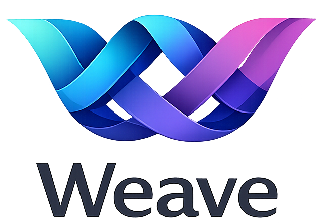

<p align="center">
  
</p>

# Weave Agent Fleet

A fleet orchestrator for managing multiple [OpenCode](https://opencode.ai) AI agent sessions from a single web UI. Spawn, monitor, and interact with parallel AI coding agents across different workspaces — with workspace isolation, real-time streaming, and completion callbacks.

## Table of Contents

- [Overview](#overview)
- [Quick Start](#quick-start)
  - [Prerequisites](#prerequisites)
  - [Install](#install)
  - [Run](#run)
  - [Update](#update)
  - [Uninstall](#uninstall)
- [Features](#features)
  - [Session Management](#session-management)
  - [Workspace Isolation](#workspace-isolation)
  - [Completion Callbacks](#completion-callbacks)
  - [Diff Viewer](#diff-viewer)
  - [Notifications](#notifications)
  - [Command Palette](#command-palette)
  - [Desktop App](#desktop-app)
- [Configuration](#configuration)
- [Architecture](#architecture)
- [API](#api)
- [Development](#development)
- [License](#license)

## Overview

- **Multi-session orchestration** — spawn and manage multiple OpenCode agent sessions in parallel from a single dashboard.
- **Workspace isolation** — run agents in isolated git worktrees or cloned repos to prevent conflicts during parallel work.
- **Real-time streaming** — monitor agent activity, messages, and tool calls via Server-Sent Events (SSE).
- **Completion callbacks** — parent sessions are automatically notified when child sessions finish, enabling orchestrated multi-agent workflows.
- **Diff viewer** — inspect file changes produced by each session with a side-by-side diff viewer.
- **Session history** — browse, search, and resume past sessions with full conversation history.
- **Desktop app** — optional native desktop experience via Tauri.

## Quick Start

### Prerequisites

- [OpenCode CLI](https://opencode.ai) must be installed: `curl -fsSL https://opencode.ai/install | bash`

### Install

**macOS / Linux:**

```sh
curl -fsSL https://get.tryweave.io/agent-fleet.sh | sh
```

**Windows (PowerShell):**

```powershell
irm https://github.com/pgermishuys/weave-agent-fleet/releases/latest/download/install.ps1 | iex
```

### Run

```sh
weave-fleet
```

Open [http://localhost:3000](http://localhost:3000) in your browser.

To use a custom port:

```sh
weave-fleet --port 8080
```

### Update

```sh
weave-fleet update
```

### Uninstall

```sh
weave-fleet uninstall
```

## Features

### Session Management

Create, monitor, fork, resume, abort, and terminate agent sessions from the web UI. Each session runs its own `opencode serve` process with full tool access. Sessions can be organized by workspace and tracked through their lifecycle:

| Action | Description |
| :--- | :--- |
| **Create** | Spawn a new session with a directory, title, and optional isolation strategy. |
| **Prompt** | Send instructions to a running session. |
| **Fork** | Branch a session into a new independent session. |
| **Resume** | Continue a previously idle session from where it left off. |
| **Abort** | Cancel the currently running operation in a session. |
| **Terminate** | Stop a session and its underlying process. |
| **Delete** | Remove a session and its history permanently. |

### Workspace Isolation

When running multiple sessions against the same repository, isolation prevents conflicts:

| Strategy | Use When | Parallel-Safe |
| :--- | :--- | :--- |
| `worktree` | Parallel work on the same repo | ✅ Each session gets its own git worktree and branch |
| `clone` | Completely isolated environments | ✅ Each session gets a separate shallow clone |
| `existing` | Single session, or separate repos | ❌ Sessions share the same directory |

### Completion Callbacks

Parent sessions can register an `onComplete` callback when spawning child sessions. When a child finishes, the Fleet automatically notifies the parent with a summary of changed files and session status — enabling fully orchestrated multi-agent workflows without polling.

### Diff Viewer

Inspect the file changes each session produced with a side-by-side diff viewer. View added, modified, and deleted files at a glance after a session completes.

### Notifications

Real-time notification system with SSE streaming. Get notified when sessions complete, encounter errors, or require attention. Unread counts are tracked per-session.

### Command Palette

Quick-access command palette (⌘K) for navigating sessions, triggering actions, and searching across the fleet.

### Desktop App

Optional native desktop experience built with [Tauri](https://tauri.app). Build with:

```sh
npm run tauri:build
```

## Configuration

| Environment Variable | Default | Description |
| :--- | :--- | :--- |
| `PORT` | `3000` | Server port (can also be set with `--port <number>` flag) |
| `WEAVE_HOSTNAME` | `0.0.0.0` | Server bind address (replaces `HOSTNAME` to avoid collision with the shell built-in) |
| `WEAVE_DB_PATH` | `~/.weave/fleet.db` (macOS/Linux), `%USERPROFILE%\.weave\fleet.db` (Windows) | SQLite database path |
| `WEAVE_INSTALL_DIR` | `~/.weave/fleet` (macOS/Linux), `%LOCALAPPDATA%\weave\fleet` (Windows) | Installation directory (used by installer) |

## Architecture

| Layer | Technology |
| :--- | :--- |
| **Framework** | Next.js 16 (App Router) with React 19 |
| **Database** | SQLite via better-sqlite3 (`~/.weave/fleet.db`) |
| **AI Backend** | OpenCode SDK — each session spawns an `opencode serve` process |
| **UI** | Tailwind CSS + Shadcn UI (Radix primitives) |
| **Desktop** | Tauri (optional native wrapper) |
| **Streaming** | Server-Sent Events (SSE) for real-time updates |

## API

The Fleet exposes a REST API for programmatic session management and orchestration:

| Endpoint | Method | Description |
| :--- | :--- | :--- |
| `/api/sessions` | `GET` | List all active sessions |
| `/api/sessions` | `POST` | Create a new session |
| `/api/sessions/:id` | `GET` | Get session details and messages |
| `/api/sessions/:id` | `DELETE` | Delete a session |
| `/api/sessions/:id/prompt` | `POST` | Send a prompt to a session |
| `/api/sessions/:id/fork` | `POST` | Fork a session |
| `/api/sessions/:id/resume` | `POST` | Resume an idle session |
| `/api/sessions/:id/abort` | `POST` | Abort a running operation |
| `/api/sessions/:id/status` | `GET` | Get session status |
| `/api/sessions/:id/diffs` | `GET` | Get file diffs for a session |
| `/api/sessions/:id/events` | `GET` | SSE stream of session events |
| `/api/sessions/:id/messages` | `GET` | Get session messages |
| `/api/sessions/:id/command` | `POST` | Execute a command in a session |
| `/api/sessions/history` | `GET` | Browse past sessions |
| `/api/fleet/summary` | `GET` | Fleet-wide status summary |
| `/api/notifications` | `GET` | List notifications |
| `/api/notifications/stream` | `GET` | SSE stream of notifications |
| `/api/notifications/unread-count` | `GET` | Get unread notification count |
| `/api/notifications/:id` | `PATCH` | Mark notification as read |
| `/api/config` | `GET` | Get fleet configuration |
| `/api/skills` | `GET` | List available skills |
| `/api/skills/:name` | `GET` | Get skill details |
| `/api/version` | `GET` | Get fleet version |
| `/api/directories` | `GET` | List available directories |
| `/api/workspace-roots` | `GET` | List workspace roots |
| `/api/workspace-roots/:id` | `DELETE` | Remove a workspace root |
| `/api/instances/:id/models` | `GET` | List models for an instance |
| `/api/instances/:id/agents` | `GET` | List agents for an instance |
| `/api/instances/:id/commands` | `GET` | List commands for an instance |
| `/api/instances/:id/find/files` | `GET` | Find files in an instance workspace |
| `/api/workspaces/:id` | `GET` | Get workspace details |
| `/api/open-directory` | `POST` | Open a directory in the OS file manager |
| `/api/available-tools` | `GET` | List available tools |

## Development

### Setup

```sh
bun install
bun run dev
```

Open [http://localhost:3000](http://localhost:3000) with your browser.

### Commands

| Command | Description |
| :--- | :--- |
| `bun run dev` | Start development server |
| `bun run build` | Production build |
| `bun run lint` | Run ESLint |
| `bun run typecheck` | TypeScript type checking |
| `bun run test` | Run tests |
| `bun run test:watch` | Run tests in watch mode |
| `npm run build:standalone` | Build self-contained distribution |
| `npm run tauri:build` | Build desktop app |

## License

Private — see repository settings.
